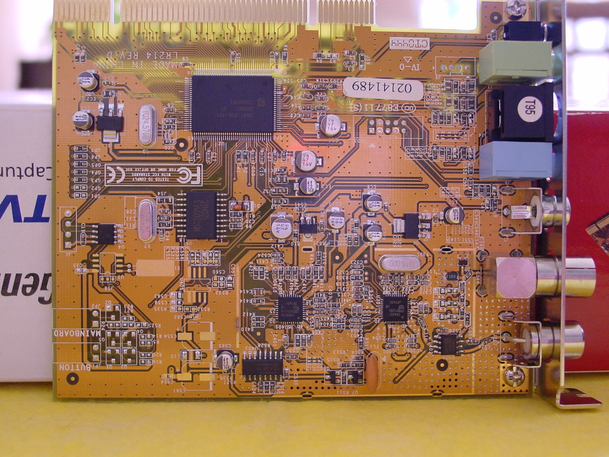

# How-to-contribute-to-the-Linux-kernel (2005-2022)
This is an example of how to contribute code to the Linux kernel - and (maybe) have your contribution then stay in the current Linux kernel for decades.

During 2005 I wanted to make a code contribution of any significance, to the Linux kernel (then at version 2.16.12), and ideally have that contribution stay there for some time.

It is now 2022 and even though it is almost two decades later a traceable contribution to the 2005 kernel patch, is still part of the current 5.17 Linux kernel. 

Refer to [**card number 86 in the SAA7134 cards list**](https://www.kernel.org/doc/html/latest/admin-guide/media/saa7134-cardlist.html) and [**saa7134.h**](https://git.kernel.org/pub/scm/linux/kernel/git/torvalds/linux.git/tree/drivers/media/pci/saa7134/saa7134.h), included in [**saa7134-cards.c**](https://git.kernel.org/pub/scm/linux/kernel/git/torvalds/linux.git/tree/drivers/media/pci/saa7134/saa7134-cards.c), - these are all from the current Linux kernel source tree.

What I did is I tested a Genius PCI analog TV Tuner card which did not work under Linux at that time (April 2005).

I then investigated the cause of the problem, and with the guidance of a video4linux and kernel maintainer (Peter Missel), assisted in providing a solution. Peter Missel then submitted a patch request to the kernel maintainers using the GPIO, and subvendor  = 0x1489, /* KYE */ subdevice  = 0x0214, /* Genius VideoWonder ProTV */ configuration information provided. The GPIO section I used to identify the card is on the left of the card picture below.

<p align="left">
 
<br>

As mentioned above, currently (February 2022) the card is identified as number 86 LifeView FlyDVB-T / Genius VideoWonder DVB-T  5168:0301, 1489:0301 in the v4l CARDLIST.saa7134. 

And there it was, even though it was only a few code lines addition I could still say "that" section of code was in part due to my effort. 

Part of my communication from 2005 with Peter Missel is included in [**comms.txt**](comms.txt), and the kernel 2.16.x source from that time is in [**kernel 2.16.12**](kernel-2-16-12).
 
The code of interest in saa7134-cards.c [**2005**](kernel-2-16-12/saa7134-cards.c) and [**2022**](saa7134-cards.c) are:
```
{
		.vendor       = PCI_VENDOR_ID_PHILIPS,
		.device       = PCI_DEVICE_ID_PHILIPS_SAA7133,
		.subvendor    = 0x1489, /* KYE */
		.subdevice    = 0x0214, /* Genius VideoWonder ProTV */
		.driver_data  = SAA7134_BOARD_FLYTVPLATINUM_FM, /* is an LR214WF actually */
}
```

